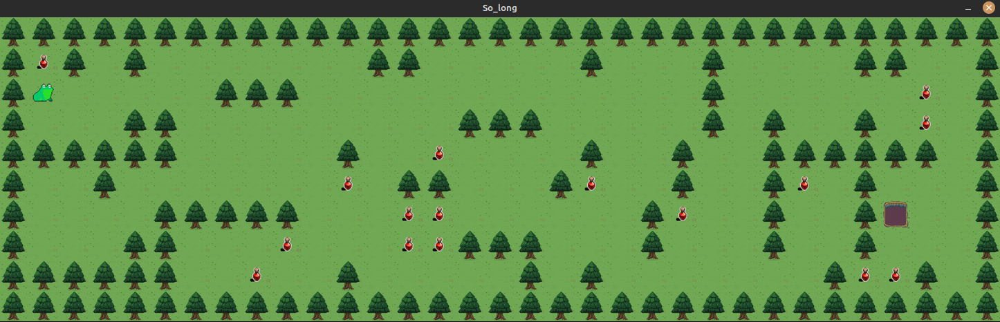

# So_long
2D game project for 42 School using the proprietary MLX library

<b>INSTALL ON LINUX</b> (only working version for now)

- open a terminal window and paste these commands in order:

1 . <tt>git clone https://github.com/IDC87/So_long.git</tt>

2 . <tt>cd So_long/main_files/</tt>

3 . <tt>make install</tt> 

4 . <tt>make play</tt> 

- to play just use the WASD keys. to exit just pres ESC or close the windows with mouse normally.
  
  
<b>  CONFIGURING MLX in Linux (Ubunt and mint)</b> 
<i> (just for people who are starting this project)</i>
 
  
This is a simple tutorial i have made from all the other tutorials i saw spread in the internet(mostly from github). With the purpose to guide through the process of working with the Minilibx library in Linux.
I took too long to have this working so i decided to create a simpler one.
   
1. <tt>git clone https://github.com/42Paris/minilibx-linux</tt>
   
 Requirements for Linux

    MinilibX only support TrueColor visual type (8,15,16,24 or 32 bits depth)
    gcc
    make
    X11 include files (package xorg)
    XShm extension must be present (package libxext-dev)
    Utility functions from BSD systems - development files (package libbsd-dev)

2. <tt>sudo apt-get install libxext-dev libxrandr-dev libx11-dev libbsd-dev libssl-dev</tt>

3. <tt>cd minilibx-linux</tt>

4. <tt>./configure</tt> (to run the script and create the minilibx.a(s))

    4.1 WARNING! if libraries could not be found please run this command:  - sudo apt-get install libc6-dev 

5. Run these commands: (outside of the minilbx folder)
   (this step is only required if you want to have the library always installed in your pc)

	<tt>sudo mv minilibx-linux/man/man1 /usr/local/man/</tt>   
	<tt>sudo mv minilibx-linux/libmlx.a /usr/local/lib/</tt>   
	<tt>sudo mv minilibx-linux/mlx.h /usr/local/include/</tt>   

6. compile example 
 <tt>gcc -Wall -Wextra -Werror main.c -lbsd -lmlx -lXext -lX11</tt>

 !!you need to have already created a main.c file for this last step to work!!

<b> Addtional notes:</b>

 convert .PNG to .XPM

 - sudo convert foo.jpg -geometry 320x240 -colors 216 foo.xpm

      - resolution can be of any choice (for sprites in small windows i choose 44x44)
      - color deph can be much lower at 64 instead of 216 value at least
